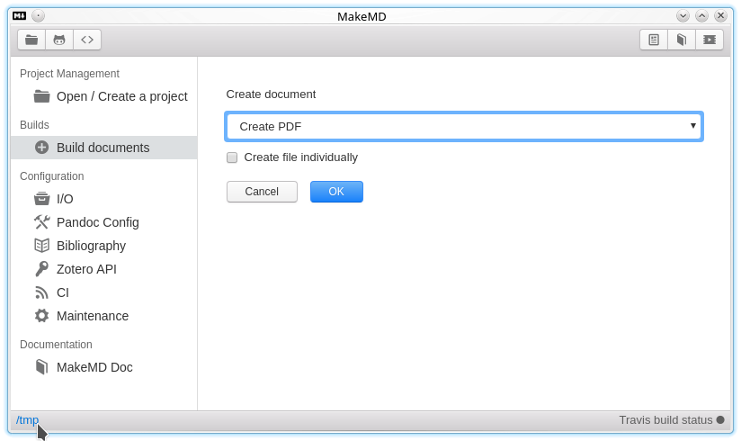

# Make-MD-electron

 [](https://travis-ci.org/Eonm/Make-MD-electron)



This project is in alpha.

Some features, such as travis config file generation, don't work.

[Documentation (fr)](https://github.com/Eonm/Make-MD-electron/wiki)

## Install

Download the last .deb file [here](https://github.com/Eonm/Make-MD-electron/releases).

```sh
  sudo dpkg -i makemd_0.1.0_amd64.deb
  sudo apt-get install -f
```

## Dependencies

```sh
  make
  curl
  pandoc
  pandoc-citeproc
  texlive-full
  nodejs
  npm
```

## Start

```sh
  npm install
  sudo npm install -g gitbook-cli
  npm start
```

## Build

On debian based systems

```sh
  # build the .deb package
  sudo apt-get install fakeroot
  npm run build
  npm run deb64

  # install the .deb package on your system
  sudo dpkg -i dist/installers/makemd_0.1.0_amd64.deb
  sudo apt-get install -f
```
